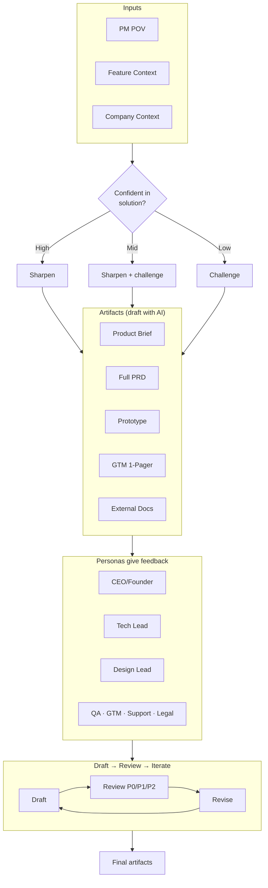

# Product Dev OS: How the System Works

**A short system-level view, then the details.**

Product Dev OS is a **product-artifact system**: you supply a small set of inputs; the system routes you to the right kind of document (brief, PRD, prototype, GTM 1-pager, or external docs); you and the AI draft it together; a swarm of AI-simulated stakeholder personas give feedback; you run Draft → Review → Iterate until the artifact is ready. Final outputs are published into your feature folder. That's the full loop. Everything below is how those pieces connect and why they're structured this way.

---

## The Full System (Conceptual)

**Inputs** — Three things feed every artifact: (1) **PM POV** — your point of view on the problem, why it matters, your hypothesis, worries, and conviction level; (2) **Feature context** — raw evidence (quotes, tickets, sales feedback); (3) **Company context** — vision, north star, goals, principles. You own the first two per feature; company context is set once and reused.

**Confidence and routing** — How confident you are in the solution doesn't just change the tone of the conversation; it changes how the AI behaves. High conviction → the system sharpens your framing. Low conviction → it challenges and pressure-tests. That same confidence often steers *which* artifact you choose: e.g. a Product Brief when you're still aligning, a Full PRD when you're ready to spec for engineering.

**Artifact menu** — You don't write "a doc." You choose from a fixed menu: Product Brief, Full PRD, Interactive Prototype, GTM 1-Pager, External Docs. Each has a workflow and a template. The system routes your intent to the right one and you draft it together with the AI.

**Persona swarm** — Once a draft exists, the system doesn't give you one generic review. It runs **personas** (CEO/Founder, Tech Lead, Design Lead, QA, GTM, Support, Legal, Data Science, etc.). Each persona comments in character; feedback is tagged P0/P1/P2 so you know what to fix first. That's the "swarm": multiple perspectives without scheduling meetings.

**Draft → Review → Iterate** — Every artifact follows the same pattern. Draft a section or phase → run the relevant personas → collect feedback → revise. Repeat until you're satisfied. The AI doesn't move to the next phase without your say-so.

**Final artifacts** — Outputs land in a per-feature folder (e.g. `Features/[feature-name]/product-brief.md`). From there you share, hand off to engineering, or spin off the next artifact (e.g. brief → PRD, or brief → prototype and GTM 1-pager). The system is modular: produce only what the feature needs.

So: **inputs → confidence-informed behavior and artifact choice → menu of artifacts drafted with the AI → persona swarm feedback → draft/review/iterate until done → final artifacts published.** That's the system.

---

## Diagram: The Full Workflow

Below is one way to visualize the same flow. Use it as a reference when reading the rest of the page or when explaining Product Dev OS to someone else.

### Option A: Mermaid (flowchart)

Renders in GitHub, GitLab, many static site generators, and Notion. For **Next.js**: use a Mermaid component (e.g. `mermaid` + dynamic import, or `@mermaid-js/mermaid-react`) and render client-side. Labels below are kept short to avoid text cutoff in fixed-width containers.

**Changing the copy:** Edit the text inside the Mermaid block (e.g. `["Artifacts (draft with AI)"]`, `B1[Sharpen]`). One source of truth; no re-export.

**Fixing text cutoff in Next.js:** (1) Wrap the diagram in a container with enough space, e.g. `
`. (2) Keep node labels short (as in this version). (3) Optional: pass Mermaid `useMaxWidth: true` in init so the chart scales to the container instead of overflowing.

**Layout:** Top-to-bottom. Inputs → confidence branch → artifact menu → persona swarm → draft/review/iterate loop → final artifacts.

### Option B: Excalidraw (or Figma)

Use when you want **pixel-perfect layout** and styling that matches your site, and you're okay re-exporting when copy changes. Draw once (or use the Mermaid structure as a spec), export SVG or PNG, and embed in Next.js (e.g. `<Image>` or inline SVG). Copy lives in the drawing tool, not in code — so wording changes mean edit in Excalidraw and re-export. Good for: one-off or rarely updated diagrams, brand-heavy pages.

**Recommendation:** Prefer **Mermaid** if you want to tweak copy often and keep the diagram in the repo as editable text. Use **Excalidraw** if you need full visual control and don't mind maintaining the diagram in a separate file.

---

## Why It's Built This Way

**Inputs first** — Without shared context, the AI fills templates with generic language. PM POV + feature context + company context give every artifact the same spine: your judgment and your evidence, plus strategy. The AI synthesizes and drafts from that; it doesn't substitute for it.

**Confidence changes behavior** — A system that only "helps you write" will agree with you when you're wrong and undercut you when you're right. Tying behavior to conviction (sharpen vs challenge) keeps the AI useful in both cases.

**Fixed artifact menu** — The system doesn't try to do everything. Five artifact types, each with a workflow and quality bar, keep outputs predictable and reusable. You choose the artifact; the system runs the process.

**Personas instead of one voice** — Real reviews come from different roles. Simulating those roles (and tagging P0/P1/P2) gives you structured, role-specific feedback without scheduling. You stay in control of which feedback to accept.

**Draft → Review → Iterate** — Shipping one-shot drafts is rare. Making the loop explicit (and phase-gated, with your approval) keeps artifacts improving instead of just longer.

**Modular outputs** — Not every feature needs a PRD, a prototype, and a GTM 1-pager. The dependency graph (e.g. brief → PRD, brief → prototype) lets you produce only what the feature and stage need. Final artifacts are just files in your repo; you decide what to do with them.

---

## Summary

Product Dev OS is a **closed loop**: inputs → confidence-informed routing and artifact choice → co-drafted artifact from a fixed menu → persona swarm feedback → draft/review/iterate until done → final artifacts published. The diagram above captures that flow. The rest is configuration: which personas, which templates, and how you fill in company and feature context. Once that's set, the system is repeatable for every feature.
